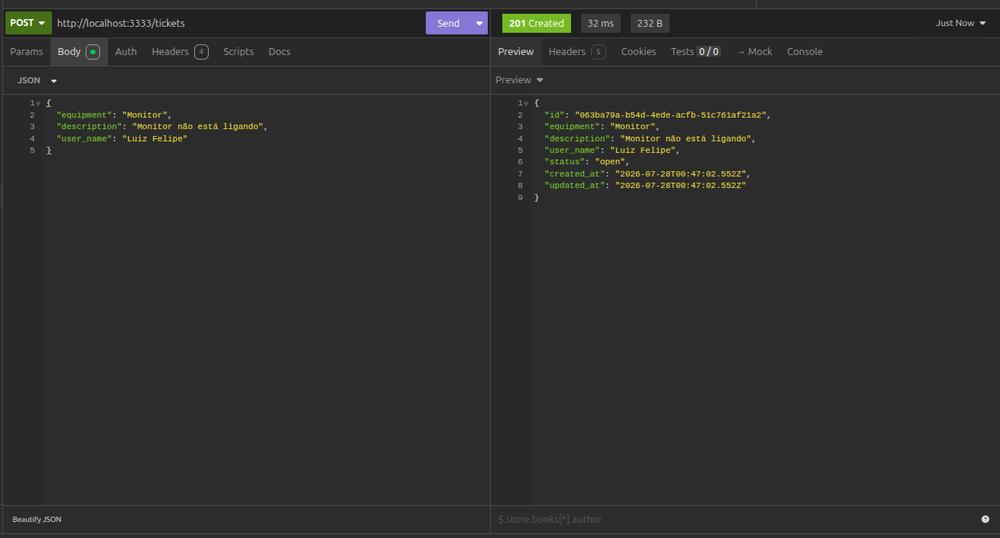

<p align="center">
  <a href="#-tecnologias">Tecnologias</a>&nbsp;&nbsp;&nbsp;|&nbsp;&nbsp;&nbsp;
  <a href="#-projeto">Projeto</a>&nbsp;&nbsp;&nbsp;|&nbsp;&nbsp;&nbsp;
  <a href="#-licença">Licença</a>
</p>

<p align="center">
  
  
</p>

<br>

<p align="center">
  
</p>


## Projeto

**Support-tickets**, API para gerenciar ticket de suporte técnico, permitindo criar um ticket solicitando suporte, atualizar as informações do ticket, listar os tickets podendo filtrar pelo status e atualizar o status de um ticket para fechado.


## Tecnologias

Esse projeto foi desenvolvido com as seguintes tecnologias:

- Node.js (ambiente)
- Javascript


### Conceitos aplicados

- Middlewares para manipulação de request e response
- Handlers de Regex para encontrar padrão em query e params
- Organização de rotas
- Controllers com métodos defininos
- Funções utilitarias 
- Manipulação de arquivo .json
- Criação de banco de dados em memória e armazenando dados em arquivo db.json
- Classes, propriedades e métodos
- Realização de requisições em HTTP Client (Insominia)

### Como rodar o projeto

Instale as dependências:

```bash
npm install
```

Inicie o servidor: Certifique-se de que o comando está definido no scripts do package.json. Geralmente:

```bash
"dev": "node --watch src/server.js"
npm run dev
```

Acessar a API: O servidor estará rodando em http://localhost:3333 (a porta é definida no código).
   


## 📝 Licença

Esse projeto está sob a licença MIT. Veja o arquivo [LICENSE](LICENSE) para mais detalhes.

---

